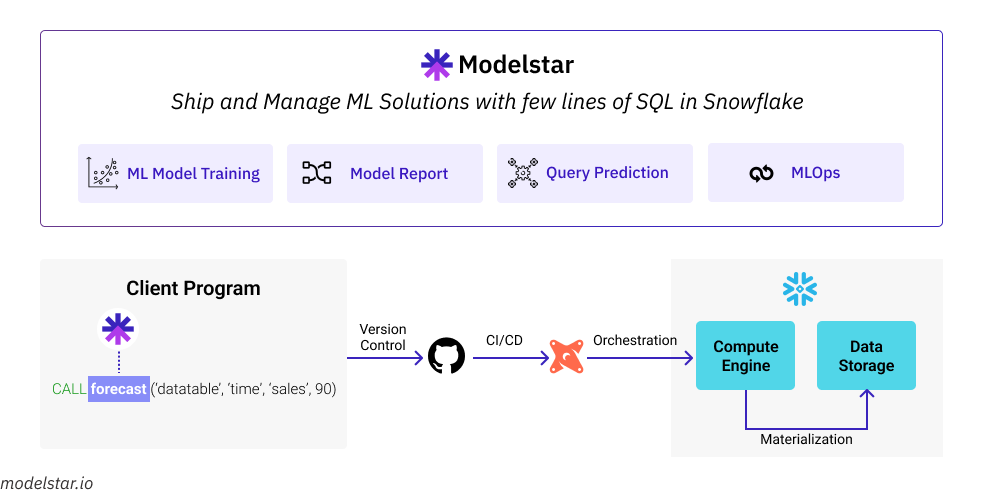

# Introduction

ModelStar is the easiest way to ship and manage machine learning solutions inside Snowflake, with only a few lines of SQL.

## Modelstar works with the modern data stack

Modelstar helps you ship and manage ML solutions in your data warehouse, with only a few lines of SQL. It currently support Snowflake. It works seemlessly within the modern data stack combining the powers of Snowflake and DBT.

## Who are Modelstar built for?

-   Snowflake and DBT users.
-   Anyone who knows basic SQL.
-   Analyst, data engineers.

## Why we build Modelstar?

We've shipped 20+ ML solutions. All the projects started with:

-   Jupyter Notebook
-   CSV files containing training data
-   `import pandas as pd`

This "notebook-centric ML development flow" requires multi-disciplinary expertise in statistics, Python scripting, ML infra, and software engineering.

But, is it necessary? If not, how to make it ridiculously simple? Modelstar is our attempt to simplify ML for analysts. Our design philosophy is: **Data is the most critical component in ML, so shipping ML solutions should be as easy as creating data objects.**

:::info
We're interested in what you think about ML and data, drop us a line at dev@modelstar.io
:::

<!-- TODO: Roadmap -->
