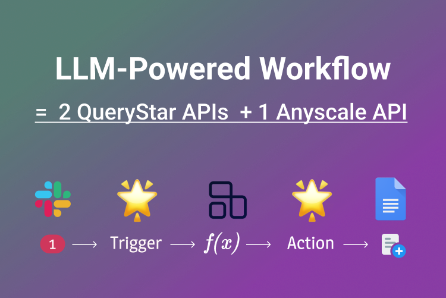
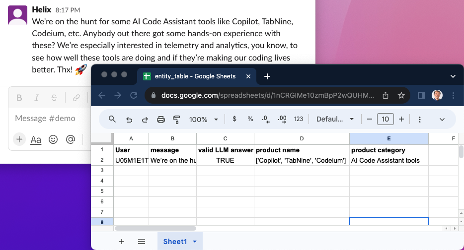

# A Slack Bot That Extracts Topic Entities and Saves Them to a Google Sheet

## Objective

Learn how to build a Slack bot that **automatically extracts key topic entities using LLM**, and use `actions.google_sheets.add_row()` to **save the entity data to a Google Sheet**.



**Usefulness:** ⭐⭐⭐⭐⭐ | **Difficulty Level:** ⭐
:::note
Source code: https://github.com/modelstar-labs/querystar-demo/tree/main/slack_gsheet_parser
:::

## About the Slack Bot

### The Use Case and Idea

I am in a Slack channel where over a thousand senior technologists discuss different tech tools and stacks. All the questions and answers arise from their years of development experience. One example of such conversations:

> Q: We're on the hunt for some AI Code Assistant tools like Copilot, TabNine, Codeium, etc. Anybody out there got some hands-on experience with these? We're especially interested in telemetry and analytics, you know, to see how well these tools are doing and if they're making our coding lives better. Thx! 🚀

> A: We've got "xxxxxx" in action, and I chatted up our engineers to get the lowdown. Here's the scoop:
>
> -   xx% of the crew keeps it fired up in their IDE 24/7.
> -   About xx% use it daily.
> -   The remaining xx% hit it up whenever they feel like it.
>
> As for how it performs, the consensus is that the code suggestions are usually solid when they hit the mark.

It's valuable to analyze the conversations and save the results in an accessible place. An interesting perspective is to understand what popular tools and services often get their attention.

So we designed this bot, which can extract:

-   Tech products/services (e.g., `AWS EC2`, `FastAPI`) are discussed in a message, and
-   The product category, e.g., "cloud service", "business intelligence", etc.

Also, the bot should extract these entities on every message, and save the results to a Google Spreadsheet.

### Module Design

-   **AI (LLM) Function**

After a new message is posted, this function should return:
`json
    {
        "product": ["<product1>", "<product2>"],
        "category": "<product category>"
    }
    `

-   **Trigger - Action**:
    -   The bot should respond to messages that are sent to a designated channel
    -   The bot should extract **Product Entities** and their **Category** from the trigger
    -   The bot should save the results in a Google Sheet.
    -   Wait for future trigger events.

### Tech Stack

We use `OpenAI` to build the LLM function, and `Querystar` for the bot. It only takes 3 API calls:

1. OpenAI's `ChatCompletion` API
2. QueryStar's `triggers.slack.new_message()`
3. QueryStar's `actions.google_sheets.add_row()`

---

## The LLM Function

The key capability of the function is to process a user message, and extract products and their category. This system prompt works quite well for this task.

> You're a technologist. Your goal is to find what technical products are discussed in the user message, and what their category is. Output a dict:
>
> {"product": ["product1", "product2"],
> "category": "product category"}
>
> If no product can be found, return an empty dict: {}

GPT is supposed to respond with a `JSON` string, so we can parse the string with a simple parser. However, GPT sometimes adds extra characters in a response, which fails our `JSON` parser. There are many tricks you can do to enforce JSON output format, such as using [`function calling`](https://platform.openai.com/docs/guides/gpt/function-calling).

For the purpose of this tutorial, let's do a quick workaround when our parser fails: we record this info and save it to the Google Sheet as well.

<details><summary>Here is the full function (click to expand)</summary>
<p>

```python
# app.app
import openai
import json

openai.api_key = 'sk-***' #add your own openai api key

def extract_product(message: str) -> dict:
    prompt = [
        {
            "role": "system",
            "content": ("You're a technologist. "
                        "Your goal is to find what technical products are discussed "
                        "in the user message, and what their category is. "
                        "Output a dict: \n"
                        "{\"product\": [\"product1\", \"product2\"],"
                        "  \"category\": \"cloud service\"}\n\n"
                        "If no product can be found, return an empty dict: {}")
        },
        {
            "role": "user",
            "content": message
        },
    ]

    response = openai.ChatCompletion.create(
        model="gpt-3.5-turbo",
        messages=prompt,
        temperature=0,
        max_tokens=500)

    try:
        product = json.loads(response.choices[0].message['content'])
        product['valid GPT answer'] = True
    except:
        product = {'valid GPT answer': False}

    return product
```

</p>
</details>

** Now that the LLM function is ready, let's build the bot 💪🏽🤖 **

## Trigger-Action

### Create a file

With QueryStar, a Slack Bot can be developed out of a short single .py file. Let's first create a file called `app.py`, and add the LLM function in it.

:::note
If this is your first time using QueryStar, follow these steps to set it up in less than 10 mins.

<details><summary>Set up QueryStar (click to expand)</summary>
<p>

First off, let's [get a QueryStar token](../../quickstart/token), [installed the library](../../quickstart/install), and make sure you can [run the `hello world` Slack bot](../../quickstart/coding). The setup process should only .

Note:

-   QueryStar automatically integrate 3rd party API services which also include Slack authorization, so we do **NOT** need a Slack token here.
-   QueryStar token is free for one Slack workspace connection and unlimited bots in that workspace.

</p>
</details>
:::

### `slack.new_message()` Trigger

This Slack message `trigger` can be easily done with QueryStar's `triggers.slack.new_message()` function:

```python
import querystar as qs

message = qs.triggers.slack.new_message(channel_id='C***')
```

This script is quite self-explanatory. The bot is set to listen to new Slack messages sent to a channel (denoted by the `channel_id`). When the trigger even happens, a `JSON` object returns.

<details><summary>An example message object (click to expand)</summary>
<p>

```json
{
   "client_msg_id":"...",
   "type":"message",
   "text":"I've been trying...",
   "user":"useid...",
   "ts":"1693582549.746649",
   "blocks":[...],
   "team":"...",
   "thread_ts":"1693536314.270179",
   "parent_user_id":"...",
   "channel":"C05PRRJ0H4N",
   "event_ts":"1693582549.746649",
   "channel_type":"group"
}
```

</p>
</details>

### `google_sheet.add_message()` Action

Once a trigger event happens, the bot calls the LLM function and get extracted product entities and category. Then, the bot adds the extracted data to a Google Sheet. The code:

```python
product = extract_product(message['text'])

qs.actions.google_sheets.add_row(
    spreadsheet_id='add your spreadsheet_id here',
    worksheet_id='Sheet1',
    data=[[message['user'], message['text'], product['valid GPT answer'],
           repr(product['product']), product['category'] ]]
    )

```

There are five columns in the entity table:

-   `User`: Slack's `user_id`
-   `message`: Slack message content
-   `valid GPT answer`: if the GPT response is a valid `JSON` string
-   `product name`: a list of product names identified by GPT
-   `product category`: product category identified by GPT

We can add rows by sending this 2D array to Google Sheet via `google_sheets.add_row()` API.

```python
[
  [
    message['user'],
    message['text'],
    product['valid GPT answer'],
    product['product'],
    product['category']
  ]
]
```

One thing requires attention here is that Google Sheet does not accept `list` data type. We need to convert a list (`product['product']`) to a string using Python built-in `repr()` function.

## Result

Open your terminal and run this command in the folder that contains your `app.py`:

```shell
$ querystar run app.py
```

Now, go to Slack and send the example message as shown in the section of [The Use Case and Idea](#the-use-case-and-idea). In 1-2 seconds, a new row is added to the Google Sheet as shown below.

:::info

:::
